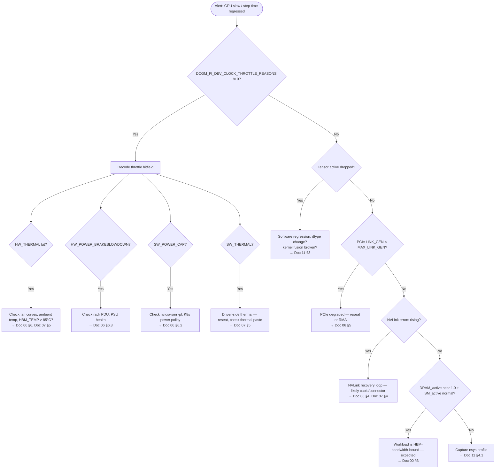
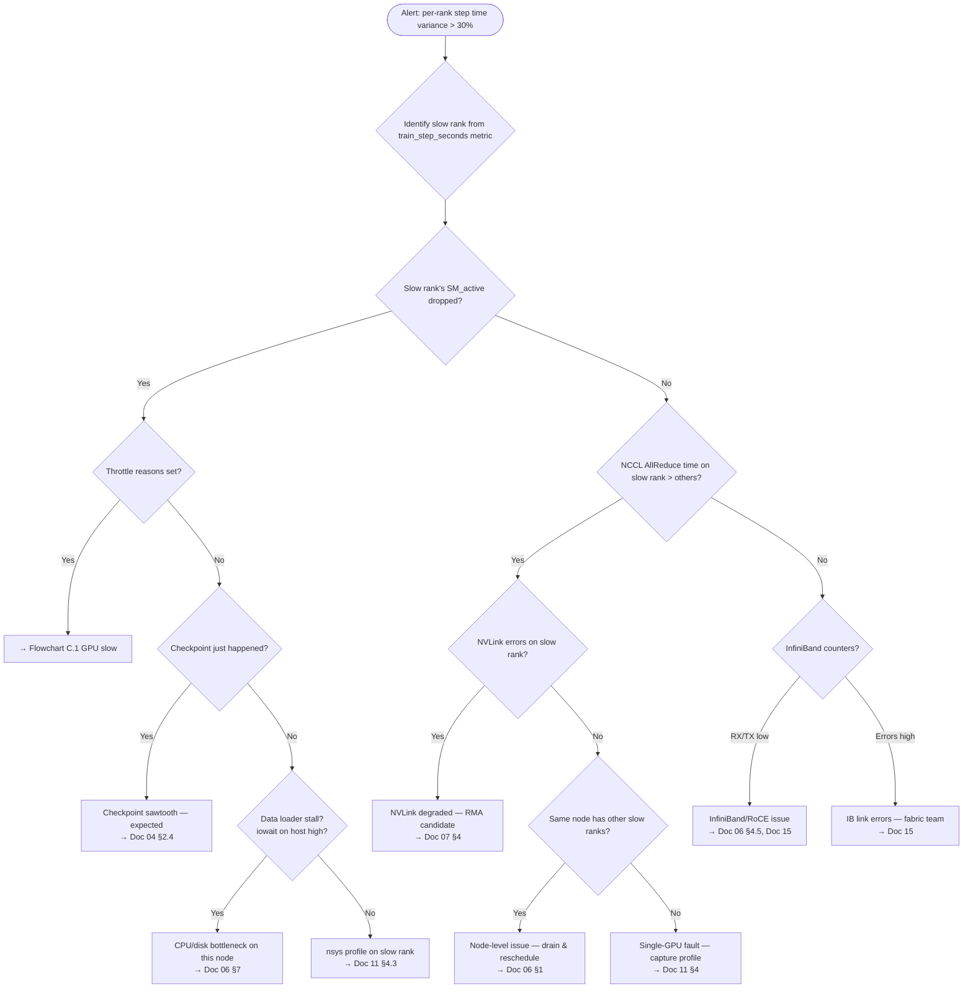
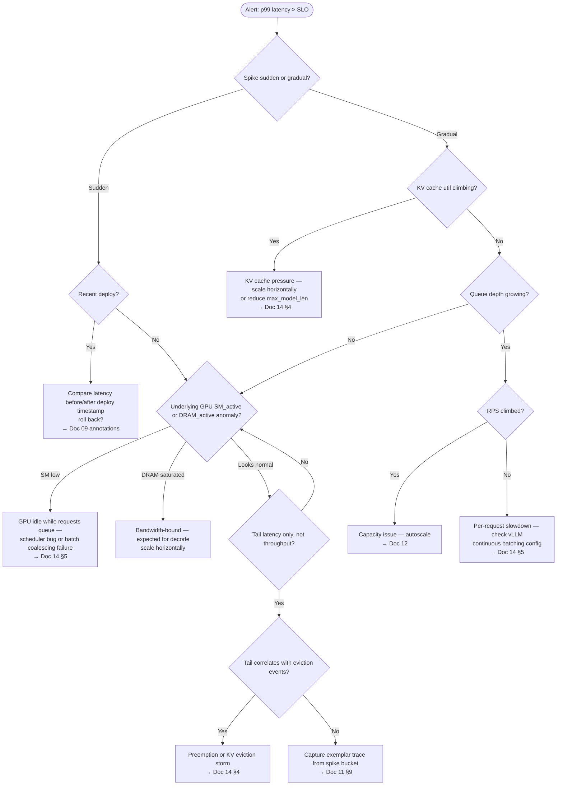
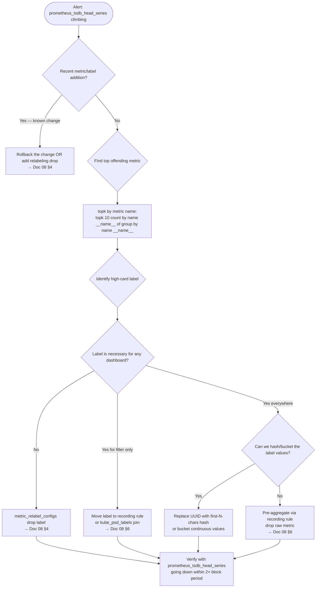
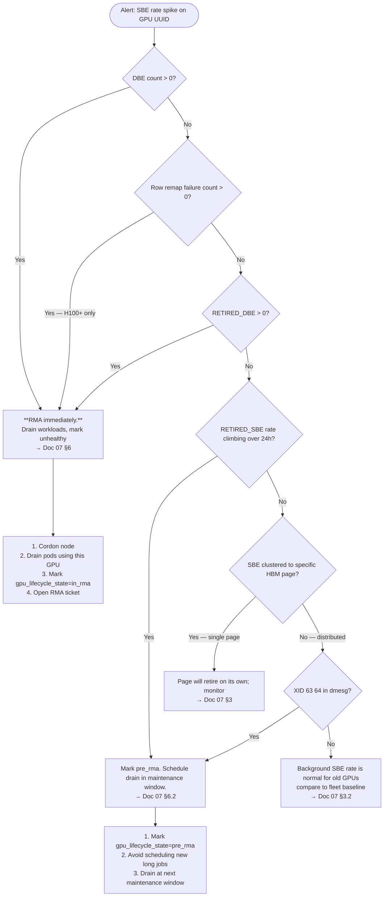
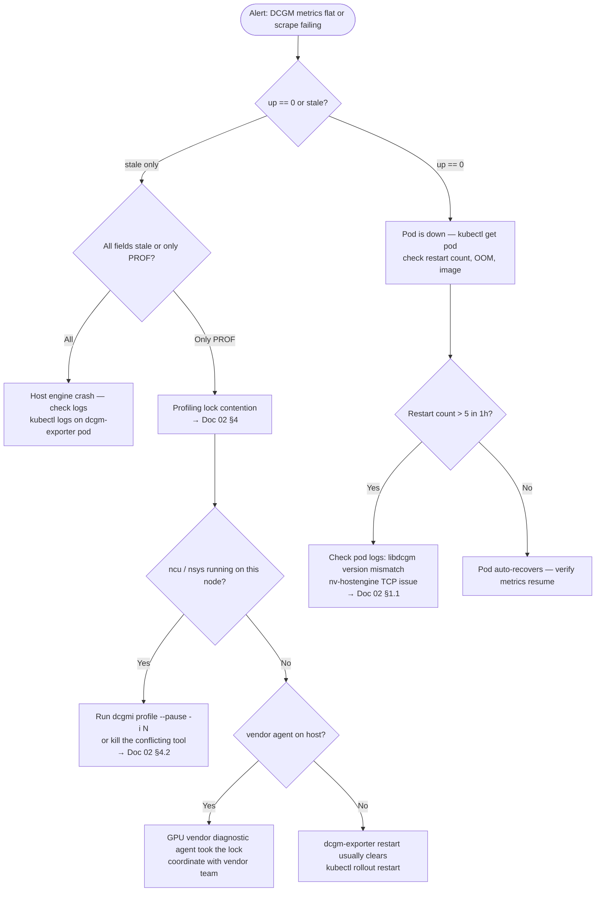
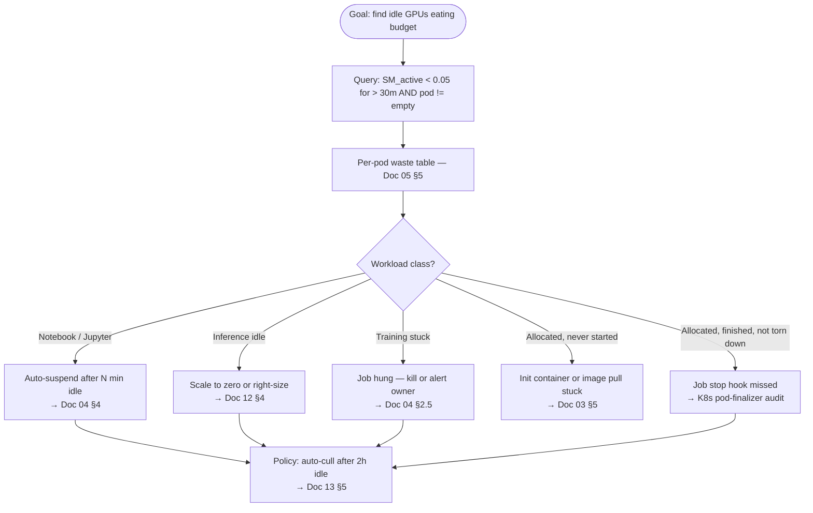

# Appendix C — Troubleshooting Flowcharts

> Decision trees for the five most common GPU-observability scenarios. When an alert fires at 3 AM, the on-call follows a flowchart, not a textbook. Print these and stick them on the wall.

Each flowchart starts from a **symptom** the on-call sees on a dashboard or in a page. Each branch leads to a **resolution** (fix, escalation, RMA) or to a deeper sub-flow in another chapter.

These are written in Mermaid. They render in GitHub, GitLab, most Markdown previewers, and Grafana 10+ markdown panels.

---

## C.1 "GPU Is Slow" — Throttle / Performance Drop

The most common page. SM_active or step-time degraded but no hard failure.



**Common resolutions:**
- HW thermal → cooling investigation, check ambient °C, fan duty cycle
- HW power → rack-level PSU/PDU, often correlates with neighboring nodes
- PCIe degraded → reseat card, escalate to hardware team
- NVLink errors → cable/connector reseat; if persistent, RMA the GPU

> **First-look PromQL** (paste into Grafana Explore for a node):
>
> ```promql
> # All throttle reasons broken out for a node
> DCGM_FI_DEV_CLOCK_THROTTLE_REASONS{Hostname="$node"}
> DCGM_FI_DEV_GPU_TEMP{Hostname="$node"}
> DCGM_FI_DEV_MEMORY_TEMP{Hostname="$node"}
> DCGM_FI_DEV_POWER_USAGE{Hostname="$node"}
> ```

---

## C.2 Training Straggler — One Rank Slower Than Others

A distributed training job has step time variance. Some ranks at 0.5s, one at 2.0s.



**Common resolutions:**
- Single-GPU thermal/power → drain pod, reschedule, RMA if recurring
- NVLink/IB error → fabric-team handoff
- Data loader stall → check `iowait`, dataset shard distribution
- Checkpoint sawtooth → not a real problem; tune checkpoint frequency

> **First-look PromQL:**
>
> ```promql
> # Per-rank step time, p50 and p99
> histogram_quantile(0.99, sum by (rank, le) (rate(train_step_seconds_bucket{job_id="$job_id"}[1m])))
>
> # Per-rank SM_active to confirm slow rank's GPU is actually running
> avg by (rank) (
>   DCGM_FI_PROF_SM_ACTIVE
>   * on(pod, namespace) group_left(rank) kube_pod_labels{label_job_id="$job_id"}
> )
> ```

---

## C.3 Inference p99 Spike — Latency SLO Burning

Inference service p99 latency exceeds threshold; error budget burning.



**Common resolutions:**
- Deploy regression → rollback, then bisect
- KV cache pressure → horizontal scale, or shrink max context
- Scheduler/batch failure → check `vllm:num_requests_waiting` vs `vllm:num_requests_running`
- Underlying hardware → drop into Flowchart C.1 / C.5

> **First-look PromQL:**
>
> ```promql
> # p99 vs p50 — is it tail or whole distribution?
> histogram_quantile(0.99, sum by (le) (rate(inference_request_duration_seconds_bucket{service="$svc"}[5m])))
> histogram_quantile(0.50, sum by (le) (rate(inference_request_duration_seconds_bucket{service="$svc"}[5m])))
>
> # vLLM internals
> vllm:num_requests_waiting{service="$svc"}
> vllm:kv_cache_usage_perc{service="$svc"}
> rate(vllm:request_preemption_total{service="$svc"}[5m])
> ```

---

## C.4 Cardinality Bomb — Prometheus Memory Climbing

Prometheus head series count or memory ballooning. Scrape latency growing.



**Common offenders to check first:**

```promql
# Top metrics by series count
topk(20, count by (__name__) ({__name__=~".+"}))

# Top labels for a specific metric
topk(20, count by (pod) (DCGM_FI_PROF_SM_ACTIVE))
topk(20, count by (gpu_uuid) (DCGM_FI_PROF_SM_ACTIVE))
```

**Common resolutions:**
- Pod label on long-running metrics → drop, rejoin via `kube_pod_labels`
- MIG GI/CI exploded → emit per-GI only on MIG-enabled nodes
- Per-request label leaked into a metric → drop label entirely
- Stale series (pod churn) → reduce `--storage.tsdb.retention.time`

---

## C.5 ECC Errors Climbing — RMA Decision

ECC SBE rate has climbed on a specific GPU; might be approaching RMA territory.



**RMA decision rule of thumb:**
- `RETIRED_DBE > 0` → RMA, no exceptions
- `ROW_REMAP_FAILURE > 0` (H100+) → RMA, no exceptions
- `RETIRED_SBE rate > 1/hour` for 24h → pre-RMA queue
- Persistent XID 63/64 → pre-RMA queue
- Old GPU with steady SBE rate but no retirement → monitor

> **First-look PromQL:**
>
> ```promql
> # SBE rate per-GPU, last 24h
> rate(DCGM_FI_DEV_ECC_SBE_VOL_TOTAL[24h])
>
> # Page retirement
> DCGM_FI_DEV_RETIRED_SBE
> DCGM_FI_DEV_RETIRED_DBE
> DCGM_FI_DEV_RETIRED_PENDING
>
> # Row remap (H100+)
> DCGM_FI_DEV_ROW_REMAP_FAILURE
> DCGM_FI_DEV_UNCORRECTABLE_REMAPPED_ROWS
> ```

---

## C.6 DCGM Stopped Reporting — Profiling Lock or Exporter Failure

Suddenly `DCGM_FI_PROF_*` series go flat or `up{job="dcgm-exporter"}=0`.



**Common resolutions:**
- Profiling lock → pause/kill conflicting tool, or `dcgmi profile --pause`
- Pod OOM → bump memory request on DaemonSet
- Version skew → align `libdcgm.so` (in image) with `nv-hostengine` version
- Host engine crash → restart pod; if recurring, check XID errors on the GPU (host engine crashes often follow GPU faults)

---

## C.7 Idle GPU Hunt — Where Is the Waste

Cluster utilization scoreboard shows wasted $; need to find the worst offenders.



> **First-look PromQL:**
>
> ```promql
> # Top 20 pods burning $ on idle GPUs (right_now snapshot)
> topk(20,
>   sum by (pod, namespace) (
>     (DCGM_FI_PROF_SM_ACTIVE < bool 0.05)
>     * on(pod, namespace) group_left() kube_pod_labels{label_workload_class!=""}
>   )
> )
> ```

---

## C.8 How to Use These Flowcharts

1. **Print or pin to runbooks.** The point of a flowchart is that you don't read it — you follow it.
2. **Link from alert annotations.** Each Doc 10 alert should `runbook_url` to the relevant flowchart.
3. **Pair with first-look PromQL.** Every flowchart includes a copy-paste block; the on-call should land in Grafana Explore with these queries within 30 seconds of being paged.
4. **Update after every incident.** If you encountered a branch the flowchart didn't cover, add it. Flowcharts are living documents.

---

## Sources

- [NVIDIA DCGM Diagnostics](https://docs.nvidia.com/datacenter/dcgm/latest/user-guide/dcgm-diagnostics.html)
- [NVIDIA Throttle Reasons (NVML)](https://docs.nvidia.com/deploy/nvml-api/group__nvmlClocksThrottleReasons.html)
- [Mermaid — flowchart syntax](https://mermaid.js.org/syntax/flowchart.html)
- Doc 06, Doc 07, Doc 10, Doc 11 — the chapters these flowcharts source resolutions from
